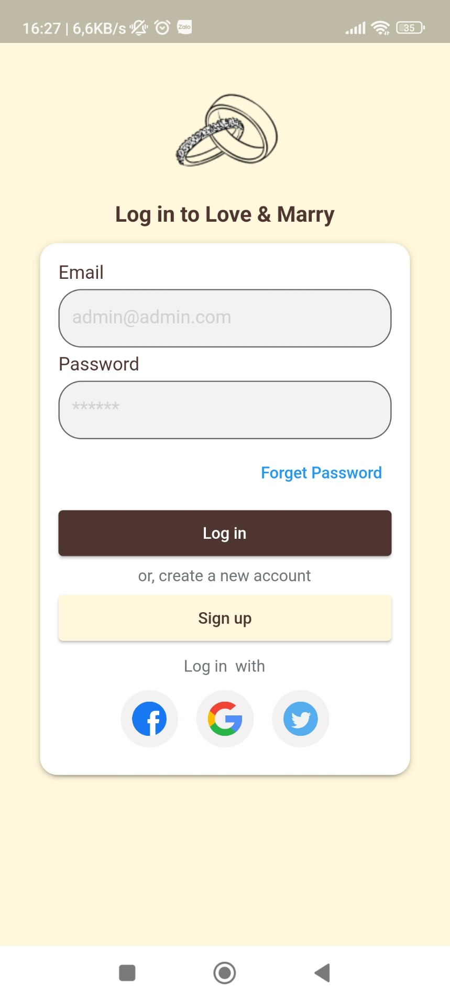

# Love and Marry

Love and Marry is a Flutter application that helps users explore and book wedding services conveniently. The app allows users to view available wedding services, choose and book them effortlessly.

## Features

- Browse the list of wedding services.
- View detailed information about each service.
- Book wedding services according to personal preferences.
- User-friendly and easy-to-use interface.

## Installation

1. Clone the project from GitHub:

   ```bash
   git clone https://github.com/truongtthuhien279/love_and_marry.git
   ```

## User Interface

<h4>1. Login Screen</h4>



<h4>2. Home Screen</h4>


<h4>3. Profile Screen</h4>


<h4>4. Suppliers Screen</h4>


<h4>5. Detail Service Screen</h4>


<h4>6. Estimated Budget Screen</h4>


<h4>7. Add Service to Estimaterd Budget </h4>


